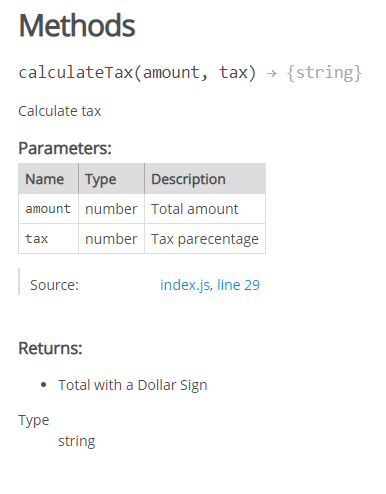
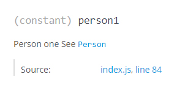

# jsDoc

Initial Release: 1999
Extended from JavaDoc

<https://jsdoc.app/index.html>

## Installation

```bash
npm init -y
```

```bash
mpm i -D jsdoc
```

## Config

create a `jsdoc.json` in root.

- source is where jsdoc looks

- `includePattern` includes evrything that ends of `.js`.

- excluding `node_modules/` and `docs`.

- `docs` will be our destination.

- plugins allows us to use `markdown`.

- `monospace` will be the font of our links in the documentation.

- `recurse` to recurse into sub folders.

```json
{
  "source":{
    "include": ["src"],
    "includePattern": ".js$",
    "excludePattern": "(node_modules/|docs)",
  },
  "plugins": ["plugins/mardown"],
  "templates": {
    "cleverLinks": true,
    "monosplaceLinks": true
  },
  "opts":{
    "recurse": true,
    "destination": "./docs/",
    "template": "custom-template"
  }
}
```

## add run Script

```json
"scripts":{
  "doc":"jsdoc -c jsdoc.json"
}
```

- `-c`: config file

## create src folder

- create an `scr` folder in `root`.

## create your Doc

and run `npm run doc`.

- one `index.html` will be generater.

## Usage

other than a `multi-line` comment

```js
/*
this is a multi-line comment
*/
```

we can use the `jsDoc` comment to write our documentation

```js
/**
 * It is a jsDoc. Can be found above methods and Class definitions.
 */
```

## Types checking

jsDoc can be used for **Type Checking**

- define the type of a variable

```js
/**
 * variable name
 * @type {string}
 */
const name = 'name';
```

- define the type an array is made of

```js
/**
 * @type {Array<number>}
 */
const arr = [2,3,4,5];
```

- define the types an Object is made of

```js
/**
 * @type {{id: number, text:string}}
 */
const obj = {
  id: 1,
  text: 'Hello'
};
```

- define multiple types

```js
/**
 * @type {{id: number|sting, text:string}}
 */
const obj = {
  id: '1',
  text: 'Hello'
};
```

## Functions and Params

- jsDoc will automatically recognize a function and pull the parameters from it.

```js
/**
 * Function Description
 * @param {number} amount - This is a Description of the Parameter intorduced with a Hyphon -
 * @param {string} tax - This is a  Description of the Parameter
 * @returns {void} - This is a  Description of the Return
 */
```



*this is how it looks like in the Documentation.*

## Type Definition (custom Type)

- define your own type.

```js
/**
 * @typedef {Object} Student
 */
```

*defining Object named Student

- define properties of the object

```js
/**
 * @property {number} id
 * @property {string} name
 * @property {string|number} [age]
 * @property {boolean} isActiv
 */
```

- use the defined type

```js
/**
 * @type {Student}
 */
const student = {
```

## Link to other parts of the Documentation

```js
/**
 * {@Link Person}
 */
const person1 = new Person();
```

## Module

```js
/**
 * Calculator module
 * @module Calculator
 */

```



## Tutorials

- create a `tutorials` folder in `root`.

- insert the `tutorials` key with the path the folder into `jsdoc.json`.

```json
"opts": {
  "tutorials": "./tutorials"
}
```

- create tutorial files inside the `tutorials` folder

- when running `jsDoc` it will incoporate the tutrials into the **Documantation**.

### Customize Naming convention for the Tutorial

- create a `tutorial.json` inside the `tutorials` folder.

```json
{
  "program-tutorial": {
    "title": "Program Tutorial"
  },
  "calculator-tutorial": {
    "title": "Calculator Tutorial"
  }
}
```

*Each tutoral file gets a title defined*

### Point to Tutorial

- use the **@tutorial** tag plus name in Braces

```js
/**
 * Calculator module - See {@tutorial calculator-tutorial}
 */
```

## Incorporate README file

- insert the `readme` key with the path the readme file into `jsdoc.json`.

```json
"opts": {
  "readme": "./README.md"
}
```

## Customize jsDoc

- copy the `default` folder from `node_modules/jsdoc/ templates` and past it into root. Rename it to 'custom-template` for example.

- insert the template into your `jsdoc.json`

```json
"opts":{
  "template": "custom-template"
}
```

### Rename the Documentation

- go into `custom-template/publish.js`

- search for `Home` and rename it.

## Implicit Type check in VSCode

**jsDoc** can be used for implicit type checking

make sure your VSCodes `settings.json` contains:

```json
"javascript.implicitProjectConfig.checkJs": true,
```

alternatively put

```js
// @ts-check
```

at the beginning of a file.
